# 📚 DSA-Programs

Welcome to the **DSA-Programs** repository! This project offers a comprehensive collection of Data Structures and Algorithms (DSA) implemented in various programming languages. Whether you're a beginner or an experienced developer, you'll find valuable resources to enhance your understanding of DSA concepts.

## 🚀 Features

- **Array ADT**: Basic operations on arrays.
- **Matrix**: Matrix manipulations and operations.
- **Linked Lists**: Singly, Doubly, and Circular Linked Lists.
- **Stacks and Queues**: Implementation of stacks, queues, and their variations.
- **Trees**: Binary Trees, Binary Search Trees, AVL Trees, and Heaps.
- **Sorting Algorithms**: Various sorting techniques.
- **Hashing**: Hash table implementations.
- **Graphs**: Graph algorithms and representations.

## 📂 Project Structure

```plaintext
├── .gitignore
├── .vscode/
│   ├── launch.json
│   ├── settings.json
│   └── tasks.json
├── 01. Array ADT/
├── 02. Matrix/
├── 03. Linked Lists/
├── 04. Circular Linked Lists/
├── 05. Doubly Linked Lists/
├── 06. Circular Doubly Linked Lists/
├── 07. Stack/
├── 08. Circular Stack/
├── 09. Queue/
├── 10. Circular Queue/
├── 11. Double Ended Queue/
├── 12. Priority Queue/
├── 13. Binary Tree/
├── 14. Binary Search Tree/
├── 15. AVL Tree/
├── 16. Heap/
├── 17. Sorting Algorithms/
├── 18. Hashing/
├── 19. Graphs/
├── Complete Classes/
├── Infix Postfix/
├── LICENSE
├── Parentheses Checking/
└── README.md
```

## 🛠️ Installation

To get started with this project, clone the repository:

```bash
git clone https://github.com/your-username/DSA-Programs.git
cd DSA-Programs
```

## 📖 Usage

Each directory contains programs related to specific data structures or algorithms. Navigate to the respective directory to explore the implementations.

## 📚 Data Structures Overview

Below is an overview of each data structure included in this repository, now illustrated using Mermaid diagrams for better understanding.

### 1. Array ADT

An array is a collection of elements identified by index or key. It is one of the simplest data structures where each data element can be accessed directly by its index.

**Diagram:**

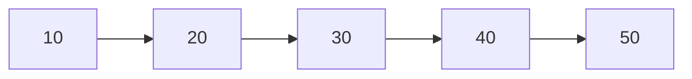

[Learn More](https://en.wikipedia.org/wiki/Array_data_structure)

### 2. Matrix

A matrix is a two-dimensional array of numbers arranged in rows and columns.

**Diagram:**

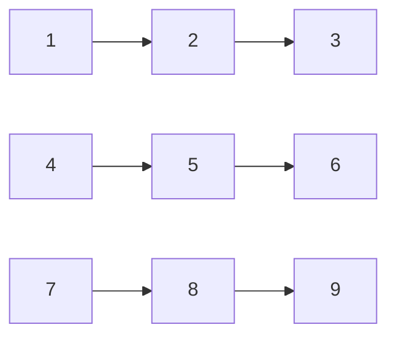

[Learn More](<https://en.wikipedia.org/wiki/Matrix_(mathematics)>)

### 3. Linked Lists

A linked list is a linear data structure where each element is a separate object, known as a node. Each node contains data and a reference (or link) to the next node in the sequence.

**Diagram:**

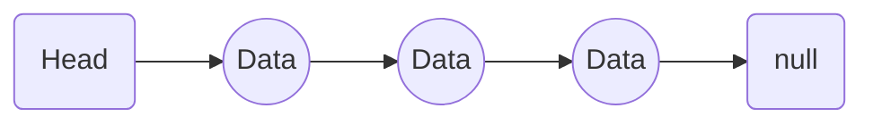

[Learn More](https://en.wikipedia.org/wiki/Linked_list)

### 4. Circular Linked Lists

A variation of a linked list where the last node points back to the first node, forming a circle.

**Diagram:**

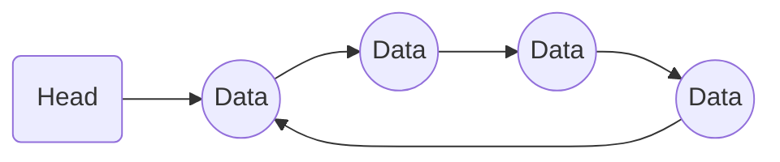

[Learn More](https://en.wikipedia.org/wiki/Linked_list)

### 5. Doubly Linked Lists

A linked list where each node contains a reference to both the next and the previous node, allowing traversal in both directions.

**Diagram:**

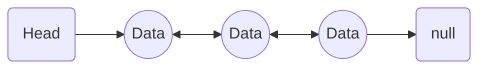

[Learn More](https://en.wikipedia.org/wiki/Doubly_linked_list)

### 6. Circular Doubly Linked Lists

A combination of circular and doubly linked lists where the last node points back to the first node, and each node has references to both the next and previous nodes.

**Diagram:**

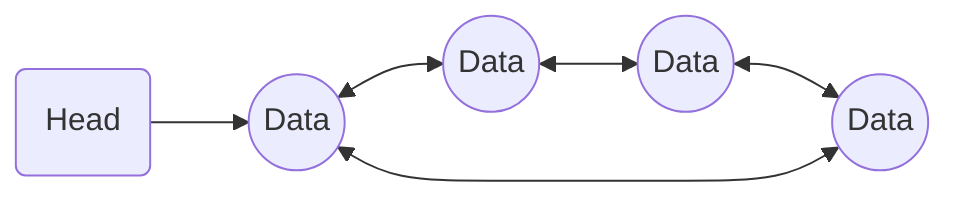

[Learn More](https://en.wikipedia.org/wiki/Doubly_linked_list#Circular_doubly_linked_lists)

### 7. Stack

A stack is a linear data structure that follows the Last In First Out (LIFO) principle. Elements are added (pushed) and removed (popped) from the same end, referred to as the top.

**Diagram:**

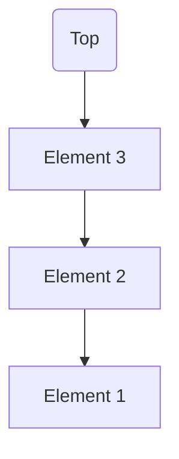

[Learn More](<https://en.wikipedia.org/wiki/Stack_(abstract_data_type)>)

### 8. Circular Stack

A circular stack is a variation of the standard stack where the end of the stack wraps around to the beginning.

**Diagram:**

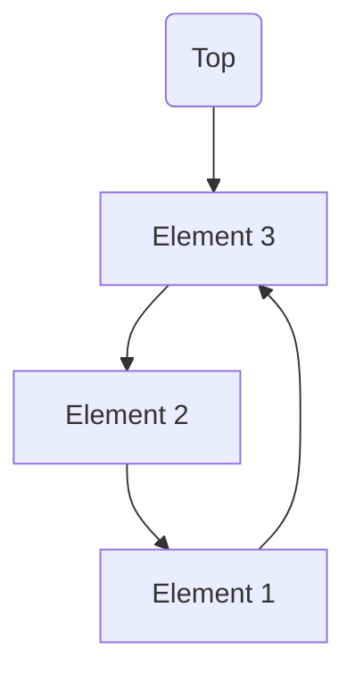

[Learn More](<https://en.wikipedia.org/wiki/Stack_(abstract_data_type)>)

### 9. Queue

A queue is a linear data structure that follows the First In First Out (FIFO) principle. Elements are added (enqueued) at the rear and removed (dequeued) from the front.

**Diagram:**

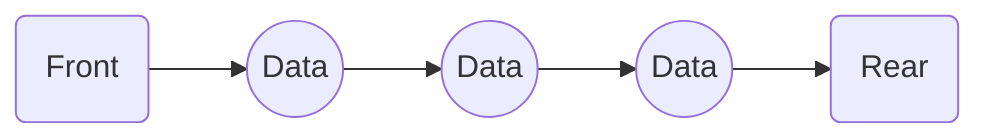

[Learn More](<https://en.wikipedia.org/wiki/Queue_(abstract_data_type)>)

### 10. Circular Queue

A circular queue is a variation of the standard queue where the last position is connected back to the first position to make a circle.

**Diagram:**

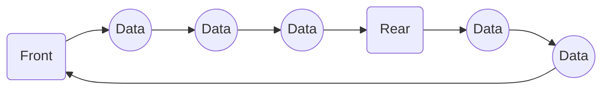

[Learn More](https://en.wikipedia.org/wiki/Circular_buffer)

### 11. Double Ended Queue

A double-ended queue (deque) is a linear data structure that allows insertion and deletion of elements from both ends.

**Diagram:**

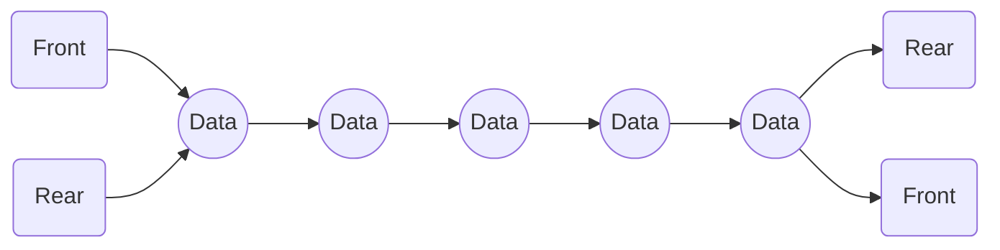

[Learn More](https://en.wikipedia.org/wiki/Double-ended_queue)

### 12. Priority Queue

A priority queue is a special type of queue in which each element is associated with a priority and elements are served based on their priority.

**Diagram:**

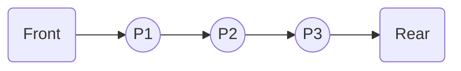

[Learn More](https://en.wikipedia.org/wiki/Priority_queue)

### 13. Binary Tree

A binary tree is a tree data structure in which each node has at most two children, referred to as the left child and the right child.

**Diagram:**

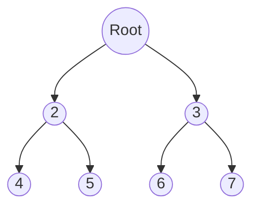

[Learn More](https://en.wikipedia.org/wiki/Binary_tree)

### 14. Binary Search Tree

A binary search tree (BST) is a binary tree in which each node has a value greater than all the values in its left subtree and less than all the values in its right subtree.

**Diagram:**

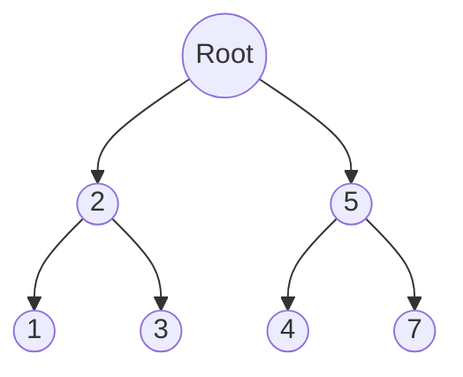

[Learn More](https://en.wikipedia.org/wiki/Binary_search_tree)

### 15. AVL Tree

An AVL tree is a self-balancing binary search tree where the difference between heights of left and right subtrees cannot be more than one for all nodes.

**Diagram:**

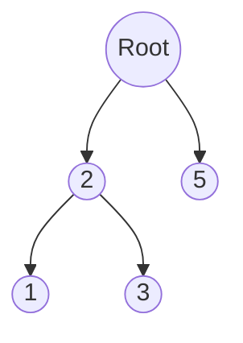

[Learn More](https://en.wikipedia.org/wiki/AVL_tree)

### 16. Heap

A heap is a special tree-based data structure that satisfies the heap property. In a max heap, for any given node I, the value of I is greater than or equal to the values of its children.

**Diagram:**

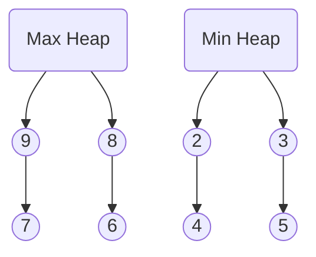

[Learn More](<https://en.wikipedia.org/wiki/Heap_(data_structure)>)

### 17. Sorting Algorithms

Sorting algorithms are methods of reorganizing a large number of items into a specific order, such as ascending or descending.

[Learn More](https://en.wikipedia.org/wiki/Sorting_algorithm)

### 18. Hashing

Hashing is a technique used to uniquely identify a specific object from a group of similar objects. A hash table is a data structure that implements an associative array abstract data type, a structure that can map keys to values.

**Diagram:**

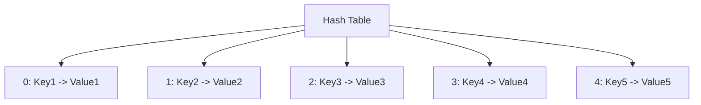

[Learn More](https://en.wikipedia.org/wiki/Hash_table)

### 19. Graphs

A graph is a collection of nodes, called vertices, and the connections between them, called edges. Graphs can be used to model many types of relations and processes in physical, biological, social, and information systems.

**Diagram:**

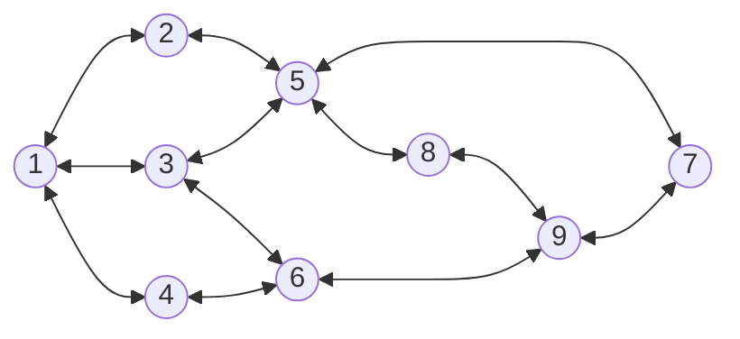

[Learn More](<https://en.wikipedia.org/wiki/Graph_(discrete_mathematics)>)

### 🛠️ Installation

To get started with this project, clone the repository:

```bash
git clone https://github.com/your-username/DSA-Programs.git
cd DSA-Programs
```

### 📖 Usage

Each directory contains programs related to specific data structures or algorithms. Navigate to the respective directory to explore the implementations.

### 🤝 Contributing

Contributions are welcome! If you have any improvements or new implementations, feel free to open a pull request.

- Fork the repository.
- Create a new branch (git checkout -b feature-branch).
- Commit your changes (git commit -m 'Add some feature').
- Push to the branch (git push origin feature-branch).
- Open a pull request.

### 📜 License

This project is licensed under the MIT License. See the LICENSE file for details.

📧 Contact

If you have any questions or suggestions, feel free to reach out to us at ijlalahmad845@gmail.com
